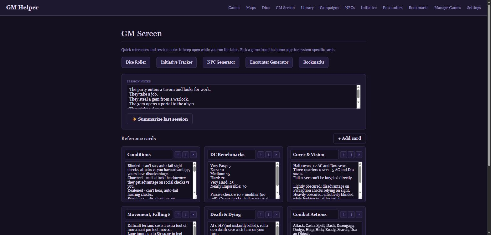

# GM Helper



A small self-hosted app for running tabletop RPG sessions: pick a game, search
your own PDF library full-text, open any book straight in your browser's PDF
viewer (search results jump right to the matching page), bookmark pages into
your own named collections with notes for session prep, flesh out a full
**Campaign Planner** for each game, generate dungeons, buildings, cities,
caves, and wilderness/world maps on the **Maps** tab, and use a dice roller,
NPC generator, initiative tracker, and encounter/loot generator while you
play. Point it at a local or hosted LLM in Settings and it also picks up a
handful of AI-assisted tools - session recaps, NPC dialogue, and one-shot
adventure generation - see **AI features** below. The auto-detected
Series-to-game grouping is just a starting guess - use
**Manage Games** in the nav to rename a game, merge one game entirely into
another, or move a single Series folder to a different game, all without
touching `games.json` by hand. When a whole Series is itself a mix (a
reference line or magazine that spans systems), the Library page lets you
check individual books and move just those to a different game - that
choice sticks even if the file changes on a later scan, and can be reset
back to automatic per book.

Older scanned PDFs with no embedded text layer can be made searchable via
OCR (Settings page) - see the OCR section below before running it on a
whole library.

## Running it on your PC (v1)

```bash
cd gm-helper
pip install -r requirements.txt
python run.py
```

Then open http://localhost:8000 in a browser.

On first run, go to **Settings** and enter the path to your library's root
folder - the folder that contains your `Publisher/Series/...` book folders
(the same one you'd point Chaptarr, Calibre, etc. at). Click **Scan library**
to find your books, then **Index new/changed books** to make them full-text
searchable. Indexing reads every PDF's text, so it can take a while the first
time on a large library - subsequent scans only re-index books that changed.

Older scanned PDFs with no embedded text layer will show up as "not
searchable" in the Library view rather than silently returning no search
results - OCR support may come later, but isn't part of v1.

## Which folders map to which "game"?

Edit `app/data/games.json`. Each game lists the Series-level folder names
(the folder directly under a Publisher folder) that belong to it, plus a
`system` hint (`"d20"`, `"palladium"`, `"savage_worlds"`, or `"generic"`)
that flavors the NPC generator's names and roles. The shipped file matches
this library's exact folder names as a starting point - nothing else in the
app hardcodes folder names, so you can freely re-map series to games, rename
games, or add new ones. Any book whose Series folder isn't listed anywhere
falls into "Unsorted / Other".

## Data storage

Everything the app tracks (your library folder setting, the book index,
saved NPCs, initiative-tracker state) lives in a single SQLite file,
`gm_helper.db`, created next to `run.py`. Nothing is written into your
library folder itself - it's only ever read from.

## Running in Docker (planned deployment path)

```bash
docker build -t gm-helper .
docker run -p 8000:8000 \
  -v /path/to/your/library:/library:ro \
  -v gm-helper-data:/data \
  gm-helper
```

Then set your library folder in Settings to `/library` (the path *inside*
the container). The SQLite DB persists in the `gm-helper-data` volume so it
survives container restarts/rebuilds.

**A note on OCR and GPUs under Docker:** EasyOCR's GPU acceleration is
CUDA-only - it has no support for Intel Arc (or any non-NVIDIA) GPU, so if
your Docker host doesn't have an NVIDIA card, OCR will run CPU-only inside
the container regardless of what video hardware is actually in the box.
The fix isn't to fight that - just run OCR on a machine with an NVIDIA GPU
first (e.g. via `python run.py` directly, as described above), then copy
the resulting `gm_helper.db` into the `gm-helper-data` volume on the Docker
host. OCR'd text lives in the database, not in the PDFs, so it carries over
with the DB file and never needs to be redone in the container.

## Campaign Planner

Each game gets its own **Campaigns** tab for fleshing out and running a
campaign, laid out the way most GM prep and campaign-wiki tools converge on:

- **Overview** - the premise/pitch, tone and themes, and a status (planning,
  active, paused, completed).
- **Plot threads** - open story threads with real stakes, tracked from seed
  through active to resolved (or dropped) instead of getting lost in notes.
- **Cast** - NPCs with a role, a disposition toward the party, what they
  want, and what they're hiding - a name alone is just set dressing. Roll
  one up on the NPC Generator page and there's a one-click "Add to
  campaign's cast" to send it straight into a campaign's Cast list.
- **Factions** - the powers pursuing their own goals while the party's
  doing something else.
- **Locations** - the map, nested under each other so you can always answer
  "where is this" by looking one level up.
- **Sessions** - prep the next one (a strong opening, potential scenes,
  secrets/clues to seed, anything else prepped) and, after the fact, log
  what actually happened - so the next prep session builds on real events
  instead of guesswork.
- **Materials** - the books and pages you'll need to run it. This reuses
  the Bookmarks system rather than a second one: every campaign gets its
  own bookmark collection automatically, so anything you add here also
  shows up on the Bookmarks page (and vice versa - a bookmark saved from a
  Library search can go straight into a campaign's collection).

Every field auto-saves as you edit it - there's no separate "save" step to
remember. Deleting a campaign removes its threads, cast, factions,
locations, sessions, and its materials collection along with it.

## Maps

The **Maps** tab procedurally generates six kinds of map as clean, scalable
SVG - no image files, no external art, nothing downloaded - and renders
instantly:

- **Dungeon** and **Building Interior** - rooms connected by corridors (a
  few extra loops beyond the minimum spanning tree, so it's not a pure
  maze), each room numbered and most labeled with a genre-appropriate name
  (a crypt or a server core, depending on setting) and occasionally a small
  feature note.
- **City / Urban** - the same recursive-subdivision idea, but the gaps
  between blocks are the streets. Each block gets a district type from a
  genre-flavored list and a color from the legend; a handful become
  named **Landmarks**.
- **Underground / Caves** - a cellular-automata cave (the classic "4-5
  rule"), rendered as smooth organic blobs rather than a blocky grid, with
  a few feature markers (an underground lake, an exposed power conduit,
  whatever the setting calls for). Disconnected pockets get tunneled into
  the main cavern so it's always fully reachable.
- **Wilderness** and **World** - a hex-grid regional/world map: a height
  field and an independent moisture field drive biome placement (ocean,
  forest, desert, mountains, and so on), a few rivers flow downhill to the
  coast (or end in a small lake if they don't reach one), and a handful of
  settlements get named and placed on hospitable land. World maps add a
  stronger pull toward ocean at the edges (so it reads as a whole
  landmass) and a tundra band near the top/bottom; wilderness maps are a
  smaller, mostly-land regional patch. Both come with a legend and a
  compass rose.

**Setting** (High Fantasy / Modern / High Technology / Mixed) is independent
of map type - a high-tech dungeon (a facility with a reactor chamber and
security checkpoints) and a fantasy building interior (a manor with a
crypt in the basement) are both fair game. Mixed draws its vocabulary from
all three settings at once, for a genuine mashup. Every map is
reproducible from its seed, though the UI's "Reroll" just asks for a fresh
one rather than tweaking an existing map by hand - regenerate until you
like it, then save.

A saved map can optionally be attached to a campaign (shows up in that
campaign's own Maps section) the same way a material can, though maps
aren't deleted if their campaign is later deleted - only detached. Every
map can be downloaded as SVG (scales to any size, editable in Inkscape/etc.)
or PNG straight from the browser.

### Editing a saved map

Every saved map's page has an **Edit map** button. Turn it on and every
generated room, block, hex, settlement, and cave feature marker becomes an
element you can click to select:

- **Drag** a selected element anywhere on the map.
- **Relabel** it by typing in the side panel's label field.
- **Recolor** it by picking one of the color swatches.
- **Delete this element** to remove it from the map entirely.
- **Add label** toggles a pin-placing mode - click anywhere on the map to
  drop a custom text label of your own, for anything the generator didn't
  think to name.

Nothing is written to the database until you click **Save edits** - reroll
around as much as you like first. **Revert to generated** throws away every
hand edit and restores the map exactly as it first came out of the
generator (this can't be undone, so it asks for confirmation first).
Corridors, streets, rivers, the legend, compass rose, and title are part of
the map's background rendering rather than individual elements, so they
aren't selectable - only the discrete, individually-meaningful pieces are.

One caveat: this works by tagging each generated element at render time, so
a map saved before this feature existed won't have those tags. Its shapes
won't be selectable or draggable, though **Add label** still works on it
(and re-saving from an older map's edit screen won't lose anything - it
just won't gain per-shape editing retroactively). Any map generated from
here on out is fully editable.

## AI features

Everything in this section is optional and off by default - none of it
shows up anywhere in the UI until you connect a working LLM endpoint in
**Settings**. GM Helper speaks two wire formats: an OpenAI-compatible
`/v1/chat/completions` endpoint (this covers Ollama, LM Studio, OpenAI
itself, OpenRouter, and most other local or hosted servers) or Anthropic's
native Messages API, picked by one provider setting. This makes it
straightforward to start with a small model on your own hardware and move
to a different endpoint later without any code changes.

Whichever provider you pick, click **Test Connection** after saving - a
feature is only offered once a real request has actually succeeded against
the *current* settings. Changing anything and saving again (even back to
identical-looking values) clears that verified state, so a stale or
half-configured endpoint can never silently power a feature; you'll always
need to re-test after a change.

Running your own model locally is entirely possible on modest hardware -
an Intel Arc GPU with 8GB of VRAM, for example, comfortably runs a model
like Qwen3.5-9B through Ollama's Vulkan backend, which needs no vendor-
specific toolkit or driver stack beyond the GPU itself being visible to
the container (`--device /dev/dri` is normally all it takes). See the
provider dropdown's inline hints in Settings for endpoint URL conventions.

Once verified, three tools light up:

- **Session recap** (GM Screen) - the "Summarize last session" button reads
  that game's session notes and writes a short "Previously on..." recap to
  read aloud to the table before play resumes. Needs at least a few words
  of session notes saved first.
- **NPC dialogue** (NPC Generator) - after rolling up an NPC, "Generate
  dialogue" writes four short in-character lines based on that NPC's role,
  quirk, and motivation - useful for finding an NPC's voice on the fly
  rather than improvising cold.
- **One-Shot Generator** (its own page, in the nav once a game is picked) -
  give it a party size, level/tier, and an optional tone or theme, and it
  writes a self-contained one-shot seed: title, hook, 2-4 key NPCs, 3-5
  scenes, a climax, and an optional twist, sized for a single 3-4 hour
  session and grounded in the conventions of whatever game system you're
  running.

A note on "thinking" models: some local models (Qwen3.5 among them) run an
internal reasoning pass before writing their actual answer, and that pass
shares the same response budget as the real output. GM Helper asks
OpenAI-compatible endpoints to skip that pass (`reasoning_effort: "none"`)
so responses come back promptly; a server that doesn't recognize that
field just ignores it.

## Project layout

```
app/
  main.py              FastAPI routes
  config.py            static paths / defaults
  database.py          SQLite schema + helpers
  campaigns.py          campaign planner (threads, cast, factions, locations, sessions, materials)
  bookmarks.py           bookmark collections + notes, shared with the campaign planner
  maps_store.py          saved-map CRUD + campaign attachment
  llm.py                 optional AI client (OpenAI-compatible / Anthropic) + the
                          verified-connection gate every AI feature checks
  maps/
    generator.py          dispatches to the right generator by map type
    rooms.py               dungeon / building interior (subdivision + corridor MST)
    urban.py                city blocks (subdivision, gaps become streets)
    caves.py                 cellular-automata caves, rendered via an SVG goo filter
    terrain.py                hex-grid wilderness/world (heightmap, biomes, rivers)
    content.py                 genre word banks (data/map_content.json) + name generator
    shapes.py                   shared subdivision + minimum-spanning-tree helpers
    svg.py                       small SVG-string builder helpers
  library/
    games.py            games.json loader (Series -> game mapping)
    scanner.py           walks the library folder, populates the books table
    indexer.py            extracts embedded PDF text into the FTS5 search index
    ocr.py                 OCRs scanned (image-only) PDFs via EasyOCR + PyMuPDF
    search.py              full-text search queries
  tools/
    dice.py, npc_generator.py, initiative.py, encounters.py
  data/
    games.json, npc_data.json, encounter_tables.json   (all user-editable)
  templates/, static/    Jinja2 + vanilla JS/CSS, no build step
```

## OCR for scanned books

Many older RPG PDFs are flat scans with no embedded text layer, so normal
indexing can't make them searchable. Settings has an **OCR scanned books**
section for those: it renders each page as an image (PyMuPDF) and reads the
text off it (EasyOCR), then feeds that text into the same search index
normal indexing uses - your PDF files on disk are never modified,
overwritten, or duplicated by this.

A few things worth knowing before running it on a whole library:
- **It's slow.** Normal indexing is seconds per *book*; OCR is more like
  seconds per *page*, so a 300-page scan can take many minutes on its own,
  and a library with hundreds of scanned books can run for hours. Use the
  "OCR a test batch (5 books)" button first to see your machine's actual
  pace before starting the full run.
- **First run downloads EasyOCR's recognition models** (needs internet
  access once; after that it's fully offline).
- **CPU vs GPU:** `pip install easyocr` pulls in PyTorch and works on CPU
  out of the box. If you have an NVIDIA GPU with CUDA set up, EasyOCR will
  generally use it automatically and run much faster - no code change
  needed here, that's purely a matter of what PyTorch build ends up
  installed.
- A book that comes back with no readable text (e.g. a truly blank or
  corrupted page) is marked as attempted so it won't be retried on a normal
  run; use **Retry failed OCR attempts** to give those another pass.
- Search results and the Library page's "Searchable" column both flag
  OCR'd text separately from embedded text, since OCR is inherently a bit
  less accurate (odd character substitutions, garbled layout in
  multi-column pages) than a real text layer.

## Running the tests

There's a pytest suite covering the pure-logic pieces of the app: the dice
parser, all the map-generation logic (room layout, minimum-spanning-tree
corridors, name/biome content, SVG output), the campaign planner, bookmarks,
the saved-maps store, the database schema/migration logic, and the
games.json series-to-game mapping used by the Manage Games page.

Install the dev dependencies (this is a separate file so pytest doesn't end
up in the production Docker image) and run:

```
pip install -r requirements-dev.txt
pytest
```

Every test runs against a throwaway temp SQLite database and a throwaway
temp `games.json`, created fresh per test and thrown away afterward - the
suite never reads or writes your real `gm_helper.db` or
`app/data/games.json`, so it's always safe to run.

This suite doesn't drive the web pages themselves (no Selenium/Playwright
browser tests are included here), so after any change that touches routes
or templates it's still worth clicking through the affected pages by hand.

## Known limitations (v1)

- Full-text search only - no structured stat-block/monster extraction yet.
- OCR output quality varies with scan quality and page layout (see above);
  it isn't a substitute for a clean embedded text layer.
- Initiative tracker keeps one active encounter per game at a time.
- Single-user, no auth - intended for a GM's own machine or trusted network.
